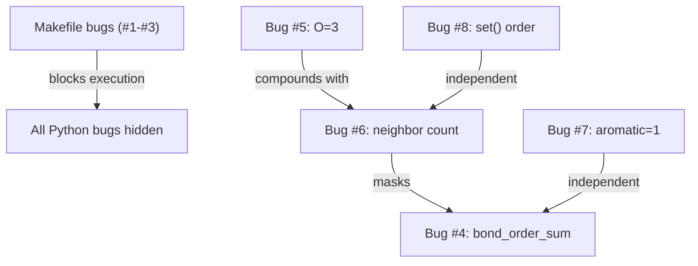

# Debug Make-based Molecular Graph Valence Audits — Implementation Plan

> **Status**: Retroactive — project already implemented. Review for changes or approval.

## Goal

Build a self-contained software engineering debugging task where a solver must repair a broken Python molecular-graph analyzer, its valence rules, and a Makefile-driven audit workflow. No internet access or third-party chemistry libraries involved.

---

## Design Decisions

### Architecture: "Broken Workspace + Verifier" Pattern

The project follows a task-runner pattern:

```
project_root/
├── task_config.toml      ← sandbox/metadata config
├── README.md             ← solver-facing task description
├── verify.sh             ← ground-truth verifier (29 checks, 7 phases)
└── workspace/            ← the broken code the solver edits
    ├── molops/            ← Python package (4 modules, bugs here)
    ├── fixtures/          ← correct JSON molecular graphs (do NOT edit)
    ├── run_audit.py       ← main entry point (correct)
    └── Makefile           ← build workflow (bugs here)
```

**Rationale**: Separating the verifier from the workspace means the solver can't "cheat" by modifying test expectations. The `workspace/` directory is the only thing they touch.

### Language & Tooling Choices

| Choice | Rationale |
|--------|-----------|
| **Python** for analyzer | Readable, no compilation step, easy to introduce subtle logic bugs |
| **GNU Make** for workflow | Realistic build-system debugging; tests Makefile literacy |
| **Bash** for verifier | Universal in sandbox environments; no dependencies |
| **JSON** for fixtures | Human-readable, stdlib `json` module, no schema deps |

### Why No Third-Party Libraries?

The task spec requires `allow_internet = false`. All chemistry knowledge (valence table, Kekulé rules) is embedded directly in the Python source. This makes the task fully self-contained and reproducible.

---

## Molecule Selection

Five molecules were chosen to exercise different code paths:

| Molecule | Formula | Key Property | Code Path Tested |
|----------|---------|-------------|------------------|
| Water | H₂O | All single bonds, has O | O valence rule (Bug #5) |
| Methane | CH₄ | All single bonds, C only | Baseline — should pass even with some bugs |
| Ethanol | C₂H₅OH | All single bonds, has O | O valence + neighbor≡bond-order for single bonds |
| **Benzene** | C₆H₆ | **Aromatic ring (1.5)** | Kekulé normalization (Bug #7), neighbor≠bond-order |
| **Acetic acid** | CH₃COOH | **C=O double bond** | Bond-order sum vs neighbor count (Bug #6), O valence |

> [!IMPORTANT]
> Benzene and acetic acid are the critical test molecules — they're the only ones with non-single bonds, which is where the neighbor-count vs bond-order-sum distinction matters.

### Fixture Design

Each fixture is a JSON graph with `atoms` (id + element) and `bonds` (atom1 + atom2 + order). Atoms are listed in ID order. Bond directionality (which atom is `atom1` vs `atom2`) is deliberately non-symmetric — this is what makes Bug #4 (bond_order_sum only checking atom1_id) produce observable failures.

---

## Bug Catalog (8 bugs across 5 files)

### Tier 1: Gatekeeping Bugs (Makefile)
These prevent `make audit` from running at all. Solver must fix these first.

| # | File | Line | Bug | Fix | Difficulty |
|---|------|------|-----|-----|------------|
| 1 | `Makefile` | 3 | `audit` missing from `.PHONY` | Add `audit` to `.PHONY` declaration | Easy |
| 2 | `Makefile` | 6 | Calls `audit_runner.py` (doesn't exist) | Change to `run_audit.py` | Easy |
| 3 | `Makefile` | 12 | `clean` does `rm -rf fixtures/` | Remove `fixtures/` — only delete report | Easy |

### Tier 2: Logic Bugs (Python modules)
These produce incorrect audit results. Solver discovers them after Makefile is fixed.

| # | File | Line | Bug | Fix | Difficulty |
|---|------|------|-----|-----|------------|
| 4 | `graph.py` | 52–56 | `bond_order_sum()` only checks `atom1_id` | Add `elif bond.atom2_id == atom_id` branch | Medium |
| 5 | `valence.py` | 12 | `STANDARD_VALENCES['O'] = 3` (should be 2) | Change to `2` | Easy |
| 6 | `valence.py` | 37 | Uses `len(get_neighbors())` not `bond_order_sum()` | Replace with `graph.bond_order_sum(atom_id)` | Hard |
| 7 | `normalize.py` | 28 | All aromatic bonds set to `1` | Kekulé alternation: `2 if i % 2 == 0 else 1` | Medium |

### Tier 3: Observability Bug (report)
Only caught by running twice with different hash seeds.

| # | File | Line | Bug | Fix | Difficulty |
|---|------|------|-----|-----|------------|
| 8 | `report.py` | 24 | `set(results.keys())` — non-deterministic | `sorted(results.keys())` | Medium |

### Bug Interaction Chain

This is the most interesting design aspect — bugs don't exist in isolation:



> [!TIP]
> **Debugging chain**: Fix Makefile → see FAIL entries → fix O valence → still FAILs → realize neighbor count ≠ bond-order sum → fix to use `bond_order_sum()` → new FAILs from broken `bond_order_sum` → fix the `atom2_id` branch → benzene still fails → fix Kekulé normalization → non-deterministic output → fix `sorted()`.

---

## Verification Strategy

### 7-Phase Verifier ([verify.sh](file:///c:/anti/New%20folder/verify.sh))

| Phase | What It Checks | # Tests | Catches |
|-------|---------------|---------|---------|
| **1. Makefile structure** | Script name, `.PHONY`, clean safety | 4 | Bugs #1, #2, #3 |
| **2. Audit execution** | `make audit` exit code, report file exists | 2 | All (transitively) |
| **3. Report content** | All 5 molecules present, no FAILs, summary | 8 | Bugs #4–#7 |
| **4. Valence spot-checks** | Specific `expected=X actual=Y` values | 6 | Bugs #4, #5, #6, #7 |
| **5. Determinism** | Two runs with different `PYTHONHASHSEED` | 1 | Bug #8 |
| **6. Clean safety** | Fixtures survive `make clean`, report deleted | 2 | Bug #3 |
| **7. Module integrity** | Imports, valence table values, `bond_order_sum` both sides | 6 | Bugs #4, #5 |

**Total: 29 checks**

> [!NOTE]
> Phase 5 uses `PYTHONHASHSEED=13579` and `PYTHONHASHSEED=97531` to force different hash orderings. With `set()` iteration, the molecule order differs between runs. With `sorted()`, it's stable regardless.

### Early Exit Strategy

The verifier exits early at Phase 2 if the report file isn't created — this prevents confusing grep errors in later phases and gives the solver a clear "fix the Makefile first" signal.

---

## Files Breakdown

### Clean Files (no bugs — do not modify)

| File | Purpose | Lines |
|------|---------|-------|
| [\_\_init\_\_.py](file:///c:/anti/New%20folder/workspace/molops/__init__.py) | Package exports | ~15 |
| [run\_audit.py](file:///c:/anti/New%20folder/workspace/run_audit.py) | Main entry: load → normalize → validate → report | ~90 |
| [water.json](file:///c:/anti/New%20folder/workspace/fixtures/water.json) | H₂O graph fixture | ~15 |
| [methane.json](file:///c:/anti/New%20folder/workspace/fixtures/methane.json) | CH₄ graph fixture | ~20 |
| [ethanol.json](file:///c:/anti/New%20folder/workspace/fixtures/ethanol.json) | C₂H₅OH graph fixture | ~30 |
| [benzene.json](file:///c:/anti/New%20folder/workspace/fixtures/benzene.json) | C₆H₆ graph fixture | ~40 |
| [acetic\_acid.json](file:///c:/anti/New%20folder/workspace/fixtures/acetic_acid.json) | CH₃COOH graph fixture | ~25 |

### Buggy Files (solver must repair)

| File | Purpose | Bugs | Lines |
|------|---------|------|-------|
| [Makefile](file:///c:/anti/New%20folder/workspace/Makefile) | Build/audit targets | 3 | ~12 |
| [graph.py](file:///c:/anti/New%20folder/workspace/molops/graph.py) | Molecular graph data structure | 1 | ~75 |
| [valence.py](file:///c:/anti/New%20folder/workspace/molops/valence.py) | Valence rules & validation | 2 | ~45 |
| [normalize.py](file:///c:/anti/New%20folder/workspace/molops/normalize.py) | Aromatic bond normalization | 1 | ~60 |
| [report.py](file:///c:/anti/New%20folder/workspace/molops/report.py) | Report generation | 1 | ~45 |

---

## Validation Results

| State | Outcome |
|-------|---------|
| **Buggy code** (as shipped) | 1/6 passed → `VERIFICATION: FAILED` |
| **All fixes applied** | 29/29 passed → `VERIFICATION: PASSED` |

---

## Open Questions

> [!IMPORTANT]
> **1. Difficulty calibration** — The task has 8 bugs with a masking chain. The config says `difficulty = "unknown"`. Should this be set to `"medium"` or `"hard"`? The expert estimate is 30 min, junior 90 min.

> [!IMPORTANT]
> **2. Additional molecules** — Currently 5 fixtures. Would you like additional edge cases (e.g., a molecule with nitrogen like formamide HCONH₂, or a triple-bond molecule like hydrogen cyanide HCN)?

> [!NOTE]
> **3. Report format** — The current report uses a simple grep-friendly `MOLECULE: / ATOM: / STATUS:` format. Would you prefer a more structured format (e.g., YAML, CSV table)?

> [!NOTE]
> **4. Additional bugs** — Some ideas for more bugs if the task should be harder:
> - A subtle off-by-one in `_order_ring()` that breaks for odd-numbered rings
> - `run_audit.py` not sorting `os.listdir()` (currently it sorts — making it unsorted would add a second source of non-determinism)
> - A missing `if __name__ == '__main__'` guard causing double-execution on import

> [!NOTE]
> **5. Solution directory** — Should I add a `solution/` directory with the fully-fixed code as a gold reference, or is `verify.sh` sufficient as the ground truth?
